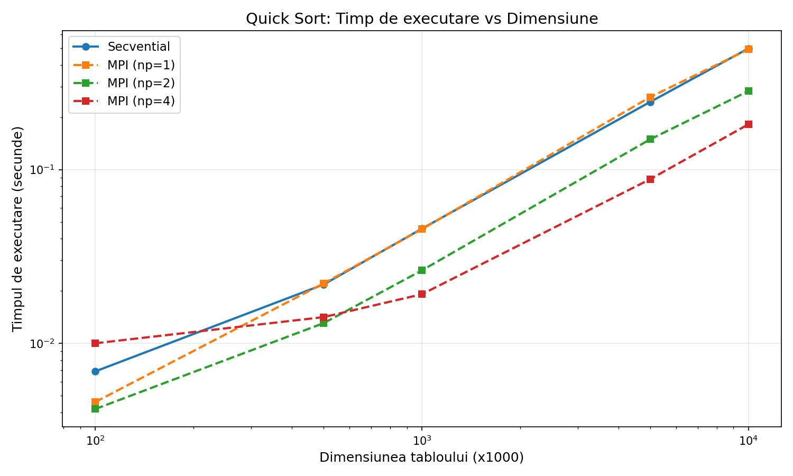
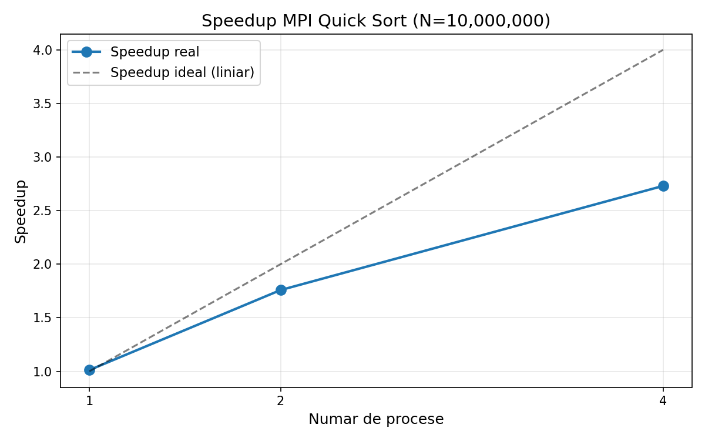

# Sortarea Rapidă (Quick Sort): Implementare Secvențială vs MPI

**Universitatea Ștefan cel Mare Suceava**
**Disciplina: Algoritmi Paraleli**

---

## 1. Introducere

Prezentul raport descrie implementarea și analiza comparativă a algoritmului de sortare rapidă (Quick Sort) în două variante:
- **Secvențială** — execuție pe un singur procesor
- **Paralelă** — utilizând MPI (Message Passing Interface) cu distribuirea datelor pe mai multe procese

Scopul lucrării este de a evalua performanța paralelizării algoritmului Quick Sort și de a analiza accelerarea (speedup-ul) obținut prin utilizarea mai multor procese.

## 2. Descrierea algoritmului Quick Sort

Quick Sort este un algoritm de sortare bazat pe principiul **divide et impera**:

1. Se alege un element **pivot** din tablou
2. Se **partiționează** tabloul astfel încât elementele mai mici decât pivotul se află în stânga, iar cele mai mari — în dreapta
3. Se aplică recursiv algoritmul pe cele două sub-tablouri

**Complexitatea:**
- Cazul mediu: O(n log n)
- Cazul cel mai nefavorabil: O(n²) — apare rar cu pivotul ales corespunzător

### Schema de partiționare Lomuto

În implementarea dată se utilizează schema Lomuto, în care pivotul este ultimul element al sub-tabloului. Indicele `i` marchează granița dintre elementele mai mici și cele mai mari decât pivotul.

## 3. Implementare secvențială

Fișierul `quicksort_seq.c` conține implementarea standard recursivă:

- Se generează un tablou aleatoriu de dimensiune N (sămânța fixă `srand(42)` pentru reproductibilitate)
- Se aplică Quick Sort pe întreg tabloul
- Se măsoară timpul de execuție cu `clock_gettime(CLOCK_MONOTONIC)`
- Se verifică corectitudinea (tabloul este sortat crescător)

**Compilare:** `gcc -O2 -Wall -o quicksort_seq quicksort_seq.c`

**Rulare:** `./quicksort_seq 1000000`

## 4. Implementare paralelă cu MPI

Fișierul `quicksort_mpi.c` implementează paralelizarea prin strategia **scatter–sort–merge**:

### 4.1 Etapele algoritmului paralel

1. **Generarea datelor** — procesul master (rank 0) generează tabloul aleatoriu
2. **Distribuirea** — `MPI_Scatter` împarte tabloul în părți egale între procese
3. **Sortarea locală** — fiecare proces aplică Quick Sort pe porțiunea sa
4. **Reunirea** — se utilizează o interclasare arborescentă (tree-based merge):
   - La fiecare pas, procesele cu rang par primesc date de la procesul vecin cu rang impar
   - Se interclasează cele două tablouri sortate
   - Procesul se repetă până când toate datele sunt reunite la procesul master

### 4.2 Schema de comunicare

```
Pas 1: P0 ← P1,  P2 ← P3
Pas 2: P0 ← P2
```

Această abordare reduce numărul de pași de comunicare la O(log p), unde p este numărul de procese.

**Compilare:** `mpicc -O2 -Wall -o quicksort_mpi quicksort_mpi.c`

**Rulare:** `mpirun -np 4 ./quicksort_mpi 1000000`

## 5. Rezultate experimentale

Testele au fost efectuate pentru dimensiuni ale tabloului: 100K, 500K, 1M, 5M, 10M elemente, cu 1, 2 și 4 procese MPI.

### 5.1 Timpul de execuție



### 5.2 Accelerarea (Speedup)



Speedup-ul se calculează ca:

**S(p) = T_secvential / T_paralel(p)**

## 6. Analiza rezultatelor

### 6.1 Observații

- **Pentru tablouri mici** (100K), overhead-ul comunicării MPI depășește beneficiul paralelizării
- **Pentru tablouri mari** (5M, 10M), paralelizarea oferă o accelerare semnificativă
- **Speedup-ul nu este liniar** din cauza:
  - Overhead-ului de comunicare (`MPI_Scatter`, `MPI_Send`/`MPI_Recv`)
  - Fazei de interclasare secvențiale la reunirea datelor
  - Dezechilibrului potențial al datelor între procese

### 6.2 Legea lui Amdahl

Conform legii lui Amdahl, speedup-ul maxim este limitat de fracțiunea secvențială a algoritmului. Faza de interclasare finală și distribuirea datelor reprezintă componente secvențiale care limitează scalabilitatea.

## 7. Concluzii

1. Algoritmul Quick Sort se pretează bine la paralelizare prin strategia scatter–sort–merge
2. MPI permite distribuirea eficientă a datelor și reunirea rezultatelor
3. Beneficiul paralelizării crește odată cu dimensiunea datelor de intrare
4. Pentru aplicații practice, este important să se aleagă numărul optimal de procese în funcție de dimensiunea problemei și de overhead-ul de comunicare

## 8. Bibliografie

1. Cormen, T.H., Leiserson, C.E., Rivest, R.L., Stein, C. — *Introduction to Algorithms*, MIT Press
2. Pacheco, P. — *An Introduction to Parallel Programming*, Morgan Kaufmann
3. MPI Forum — *MPI: A Message-Passing Interface Standard*, https://www.mpi-forum.org/
